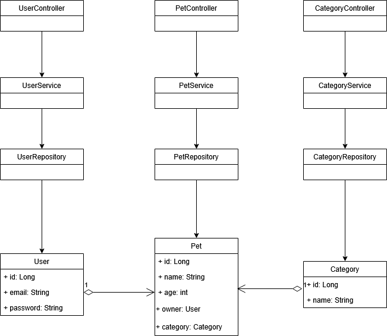
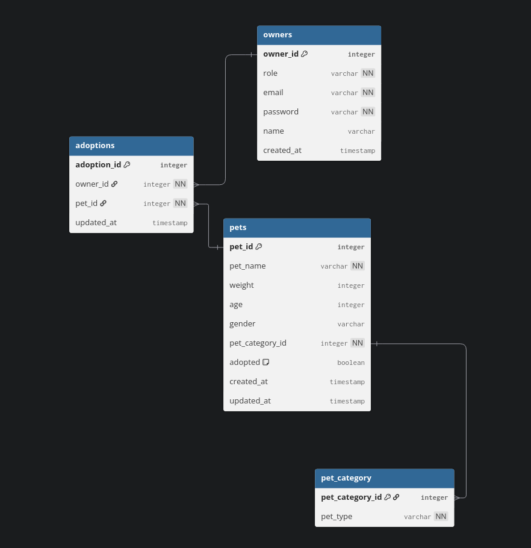

# MVC-project

## Description
This is a project about using Spring Boot + Hibernate + MySQL with Maven.

I want to deepen my skills and learn more about MVC architecture.
Spring Boot and Hibernate are new for me.
Once the project is finished/in a usable state I plan to deploy on AWS, which will be a new territory for me.

## Specifications
- **Java version:** 21 (corretto)
- **Spring boot version:** 3.5.6
- **Maven version:** 3.6.3
- **Architecture:** MVC

## Functionality
The project will be a pet shop, where the user can:
- register 
- login
- add new pet
- list pets even by categories
- new functions will be listed here while developing the project.

## Class diagram


## Database schema


## Sequence diagrams
TODO

## Testing
For testing, I will be using JUnit

Run all tests with:
```` bash
  mvn clean test
````

## Setup for personal use

### Prequisites
- Docker
- Maven (for local build)
- Java 21 (Corretto)
- NPM

### 1. Step: Build jar
If this is your first install, or you made changes inside the Spring application, then do the following command inside /backend:
```` bash
  ./mvnw clean package
```` 

Wait until maven is finished with building.

### 2. Step: Docker image build
Inside /backend write the following:
```` bash
  docker build -t pet-backend:latest .
````

With this you are building the backend with the jar file, it downloads the neccesary files for the DB and Spring

### 3. Step: Stop old container
With
```` bash
  docker ps
````

Check if there are containers that still running. If yes, do the following:
```` bash
  docker stop <container_id>
  docker rm <container_id>
````

### 4. Step: Run new container
Run the following command in the main folder (/MVC-project)
```` bash
  docker compose up --build
````

### ---- NOT WORKING WITH THIS NOW ----

In the project's main folder run the following command:
```` bash
  docker build -t mvc-project .
````

After a successful build run you can run the following command:
```` bash
  docker run -p 8080:8080 mvc-project
````

You can access the page on http://localhost:8080.
